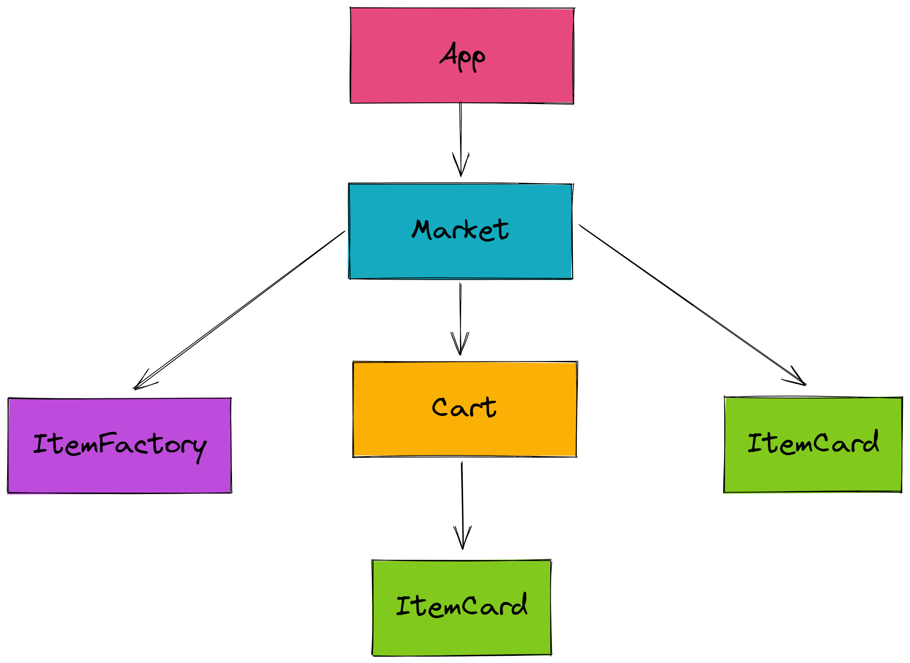

# React Workshop

{: .primer-spec-toc-ignore }

Welcome to the React Tutorial for the VOID Tech Org at the University of Michigan. The tutorial is intended to help members learn the basics of React and how to use it to build a simple web application. The tutorial is intended to be a hands-on tutorial, so the members will be following along to build the application themselves. Feel free to come back to this tutorial at any time to review the material.

## Getting Started

Make sure you are in a Unix environment (Mac or Linux). If you are on Windows, you can use the Windows Subsystem for Linux (WSL) to run a Linux environment on your Windows machine. You can find instructions on how to set up WSL [here](https://docs.microsoft.com/en-us/windows/wsl/install-win10).

To get started, you will need to download the starter code for the workshop:

Download and unpack the starter files:

```console
$ pwd
/home/santiagomed/umich/void/workshops
$ mkdir react-workshop
$ cd react-workshop
$ wget https://voidtechmichigan.org/react-workshop/starter_files.tar.gz
$ tar -xvzf starter_files.tar.gz
```

Move the starter files to your project directory and remove the original `starter_files/` directory and tarball.

```console
$ pwd
/home/santiagomed/umich/void/workshops/react-workshop
$ mv starter_files/* .
$ rm -rf starter_files starter_files.tar.gz
```

Your project directory should now look like this:

```console
$ tree
react-workshop/
├── package-lock.json
├── package.json
├── public
│   └── index.html
├── src
│   ├── App.tsx
│   ├── components
│   │   ├── Cart.tsx
│   │   ├── ItemCard.tsx
│   │   ├── ItemFactory.tsx
│   │   └── Market.tsx
│   ├── global
│   │   └── types.ts
│   ├── helper
│   │   └── api.ts
│   ├── index.tsx
│   ├── react-app-env.d.ts
│   └── reportWebVitals.ts
└── tsconfig.json
```

## Installation

Once you have cloned the repository, you will need to install Node.js and the dependencies for the project.

If you already have Node.js installed, use `wget` to install `nvm`, the Node.js version manager. You can check if you have Node.js installed by running `node --version`.

```console
$ node --version
v16.18.0
$ wget -qO- https://raw.githubusercontent.com/nvm-sh/nvm/v0.39.2/install.sh | bash
```

Then, use `nvm` to install the latest stable version of Node.js.

```console
$ nvm install --lts
```

If you do not have Node.js installed, you can install it from the [Node.js website](https://nodejs.org/en/). Make sure you install the latest stable version (LTS). As of October 20, 2022, the LTS is v16.18.0. Make sure your installation also includes `npm`, the Node.js package manager.

If you want to install `nvm` to manage your Node.js versions, you can do so through the command below. This is not necessary for the workshop, but it is recommended.

```console
$ node --version
v16.18.0
$ wget -qO- https://raw.githubusercontent.com/nvm-sh/nvm/v0.39.2/install.sh | bash
```

Once you have Node.js installed, you can install the dependencies for the project.

```console
$ pwd
/home/santiagomed/umich/void/workshops/react-workshop
$ npm ci
```

## Running the Project

Once you have installed the dependencies, you can start the development server by running the following command in your terminal:

```console
$ npm start
```

This will start the development server and open a new tab in your browser with the application running. Open [http://localhost:3000](http://localhost:3000) to view it in the browser. You can now start editing the code and the browser will automatically reload when you save your changes. You can stop the development server by pressing `Ctrl + C` (Windows) or `Cmd + C` (Mac).

If you haven't made any changes to the code, you should see a blank page with the text "Hello VOID!" in the top left corner of the page. You can now start editing the code to build the application.

## TypeScript Overview

Before we get into React, we will first go over some of the basics of TypeScript. To understand TypeScript, we need to understand were it came from.

JavaScript (JS) is a lightweight and interpreted programming language.
It  was initially built as a scripting language for browsers, but it can now be used in multiple non-browser environments, such as Node.js.

Every language has its own oddities and surprises, and JavaScript’s humble beginning makes it have many of these — "it lets you do what you want to do". So if you are not sure about what you are doing, it can lead to some very hard to debug errors.

```js
const obj = {width: 10, height: 15};
const area = obj.width * obj.heigth; // typo!
// area evaluates to NaN, but JavaScript doesn't throw an error
```

TypeScript (TS) is a superset of JavaScript that adds static typing to the language. This means that you can define the type of a variable when you declare it, and you can't change it later. This makes it easier to debug your code, and it also makes it easier to refactor your code.

In React, TypeScript has more "rules", but it saves us precious debugging time in the long run.

```ts
const obj = {width: 10, height: 15};
const area = obj.width * obj.heigth; // TypeScript will throw an error!
```

### What you need to know
Following are some things to keep in mind when writing TypeScript code:

#### Assignment and Comparison

Never use `var` to declare a variable. Always use `let` or `const`. Always use `const` to declare a variable if you don't plan on changing it.
    
```ts
var x = 10; // bad
const y = 10;
y = 20; // this is an error
let z = 10;
z = 20; // this is okay
```

Use `===` and `!==` instead of `==` and `!=`.
```ts
// bad
const x = 1;
if (x == '1') {
    // this will evaluate to true
}
// good
const x = 1;
if (x === '1') {
    // this will evaluate to false
}
```
Use `null` instead of `undefined`. `undefined` is a value that is automatically assigned to variables that are not initialized. On the other hand, `null` is a value that is explicitly assigned to variables that are not initialized.
```ts
// bad
let x;
if (x === undefined) {
    // this will evaluate to true
}
// good
let x = null;
if (x === null) {
    // this will evaluate to true
}
```
#### Objects and Functions
Objects and functions are the building blocks of TypeScript. You will be using them a lot, so it is important to understand how they work. Objects are collections of key-value pairs, and functions are blocks of code that can be called from other parts of your code.

```ts
// object
const obj = {
    key1: 'value1',
    key2: 'value2',
    key3: 'value3',
};

// function
function func() {
    console.log('Hello World!');
}
```
Object destructuring is a convenient way to extract multiple properties from an object and assign them to variables. It can also work with arrays.
```ts
const obj = {name: "void tech", coolness: "100"}
const {name, coolness} = obj;
console.log(name); // "void tech"
console.log(coolness); // "100"
```

Anonymous functions are functions that are not assigned to a variable. They are useful when you want to pass a function as an argument to another function. Arrow functions are a shorthand way to write anonymous functions.
```ts
const eboard = ['Kavya', 'Anabelle', 'Noah', 'Santiago', 'Celina', 'Kelly'];

// These two are equivalent
eboard.forEach(function(member) {
    console.log(member);
});
eboard.forEach(member => console.log(member));
```
#### Map and forEach
Don't use `for-in` loops. They are slow and can lead to unexpected behavior. Use `forEach` instead.
```ts
const eboard = ['Kavya', 'Anabelle', 'Noah', 'Santiago', 'Celina', 'Kelly'];
eboard.forEach(member => console.log(member));
// This prints out the name of each member of the eboard
```
Use `map` to transform an array into another array.
```ts
const eboard = ['Kavya', 'Anabelle', 'Noah', 'Santiago', 'Celina', 'Kelly'];
const funEboard = eboard.map(member => member + ' is fun!');
console.log(funEboard);
// This prints out an array of strings that say each member of the eboard is fun
```
#### Types and Interfaces
TypeScript has a lot of built-in types, such as `string`, `number`, `boolean`, `null`, `undefined`, `any`, `void`, `never`, `object`, and `unknown`. You can also define your own types using `type` and `interface`. `type` is a way to define a type alias, and `interface` is a way to define a new type. The difference between the two is that `type` can be used to define a union type, and `interface` cannot. A union type is a type that can be one of multiple types.
```ts
// type
type stringOrNumber = string | number;

// interface
interface Person {
    name: string;
    age: number;
}
```
#### Classes
Classes are a way to define a new type that can be instantiated. They are useful when you want to create multiple objects that have the same properties and methods.
```ts
class Person {
    name: string;
    age: number;

    constructor(name: string, age: number) {
        this.name = name;
        this.age = age;
    }

    sayHello() {
        console.log(`Hello, my name is ${this.name}!`);
    }
}

const person = new Person('Santiago', 21);
person.sayHello(); // "Hello, my name is Santiago!"
```
### Asynchronous Programming
Asynchronous programming is a way to write code such that tasks are interleaved with one another, in a single thread of control. This is useful when you want to do multiple things at once, such as making multiple API calls at the same time. JavaScript is a single-threaded language, which means that it can only do one thing at a time. However, it has a feature called the event loop that allows it to do multiple things at once. The event loop is a queue that holds all of the asynchronous tasks that need to be done. When the current task is finished, the event loop will take the next task from the queue and run it. This is why asynchronous programming is possible in JavaScript.
```ts
// synchronous
console.log('Hello');
console.log('World');

// asynchronous
console.log('Hello').then(() => console.log('World'));
// This will print "Hello" first, and then "World"
```
#### Async/Await
Async/await is a way to write asynchronous code that looks synchronous. It is syntactic sugar for promises. Async functions always return a promise, and await can only be used inside of async functions. Await will pause the execution of the async function until the promise is resolved. A Promise is an object that represents the eventual completion or failure of an asynchronous operation. It has three states: pending, fulfilled, and rejected. A promise is pending when it is waiting for the asynchronous operation to complete. A promise is fulfilled when the asynchronous operation completes successfully. A promise is rejected when the asynchronous operation fails.
```ts
// promise
const promise = new Promise((resolve, reject) => {
    setTimeout(() => {
        resolve('Hello World!');
    }, 1000);
});
// This promise will resolve after 1 second, and the value will be "Hello World!"

promise.then((result) => {
    console.log(result);
});
// This will print "Hello World!" after 1 second

// async/await
async function asyncFunc() {
    const result = await promise;
    console.log(result);
}
asyncFunc();
// This will also print "Hello World!" after 1 second, they are equivalent
```

### React and React Native
Note: The starter files we provided for this workshop already have some code written for you. It is detailed with comments to help you understand what is going on. Take some time to look over all files and think about how it all works at a high level.

React is a declarative, efficient, and flexible JavaScript library for building user interfaces. It lets you compose complex UIs from small and isolated pieces of code called "components".

The application we will be working on today has the following component tree structure:

#### JSX
JSX is a syntax extension to JavaScript. It is similar to a template language, but it has full power of JavaScript. JSX produces React "elements". React elements are plain JavaScript objects that describe what you want to see on the screen.

```jsx
const name = 'Santiago';
const element = <h1>Hello, {name}</h1>;
```

You can also use JSX inside of if statements and for loops, assign it to variables, accept it as arguments, and return it from functions.

```jsx
function getGreeting(user) {
  if (user) {
    return <h1>Hello, {formatName(user)}!</h1>;
  }
  return <h1>Hello, Stranger.</h1>;
}
```
Let's take a look at the `App.tsx` file of our application:
```tsx
import React from "react";
import Market from "./components/Market";

function App() {
  return (
    <>
      <Market />
    </>
  );
}

export default App;
```
This is the entry point of our app. We are importing our `Market` component, which is the main component of our app. We are then returning it in our `App` component. This is the component that is rendered when the app is launched. In case you are wondering, the `<>` is a shorthand for `<React.Fragment>`. It is used to wrap multiple elements without adding an extra node to the DOM. You can read more about it [here](https://reactjs.org/docs/fragments.html#short-syntax).

#### Components and Props
We render React elements through components. Components let you split the UI into independent, reusable pieces, and think about each piece in isolation. Components can be defined as classes or functions. We will be using function components for our app.

Components accept arbitrary inputs (called "props") and return React elements describing what should appear on the screen.

```tsx
function PersonInfo(props) {
  return (
    <div>
      <div> {props.name} </div>
      <div> {props.age} </div>
      <div> {props.gender} </div>
    </div>
  );
}

// We can call this component like this:
function App() {
    return (
        <PersonInfo name="Santiago" age="21" gender="male" />
    );
}
```
Let's implement the component for our `ItemCard.tsx` file:
```tsx
import React from "react";
import { Item } from "../global/types"; // Get the Item interface from the global types file

// This interface defines the props that our component will accept
interface IItemCardProps {
  item: Item;
  inCart: boolean;
  handleCart: (item: Item) => void;
  disabled?: boolean;
}

// We are using destructuring to get the props
const ItemCard = ({ item, inCart, handleCart, disabled }: IItemCardProps) => {
  return (
    <div className="card" style={{ width: "18rem", margin: "1rem" }}>
      <div className="card-body">
        <h5 className="card-title">{item.name}</h5>
        <p className="card-text">
          ${item.price} - {item.calories}kcal
        </p>
        {inCart ? (
          <button className="btn btn-danger" onClick={() => handleCart(item)}>
            Remove from cart
          </button>
        ) : (
          <button
            className="btn btn-primary"
            onClick={() => handleCart(item)}
            disabled={disabled}
          >
            Add to cart
          </button>
        )}
      </div>
    </div>
  );
};

export default ItemCard;
```
The `className` and `style` attributes are used to add CSS classes and styles to the elements. We are using [Bootstrap](https://getbootstrap.com/) for styling our app. You can read more about it [here](https://react-bootstrap.github.io/getting-started/introduction/).

The `inCart` prop is used to determine if the item is already in the cart. If it is, we will render a button to remove it from the cart. If it isn't, we will render a button to add it to the cart. We are also using the `disabled` prop to disable the button if the item is already in the cart. We will learn more about conditional rendering later on.

#### State and Hooks
State is similar to props, but it is private and fully controlled by the component. Hooks are functions that let you "hook into" React state and lifecycle features from function components. We will be using the `useState` hook to manage our state.

An example of a state variable is the `count` variable in the following component:
```tsx
import React, { useState } from "react";

function Counter() {
  // Declare a new state variable, which we'll call "count"
  const [count, setCount] = useState(0);

  return (
    <div>
      <p>You clicked {count} times</p>
      <button onClick={() => setCount(count + 1)}>Click me</button>
    </div>
  );
}
```
As you can see in the example above, we are using the `useState` hook to declare a new state variable called `count`. We are also using the `setCount` function to update the value of the `count` variable. We can use the `count` variable in our component to render the number of times the button has been clicked.

The main two hooks we will be using in our app are `useState` and `useEffect`. We will be using `useState` to manage our state and `useEffect` to perform side effects in our app. You can read more about them [here](https://reactjs.org/docs/hooks-intro.html).

```tsx
// This is the state of our app
const [cart, setCart] = useState<Item[]>([])
// cart is now [] (empty)

// We can update the state like this:
const newCart = ['purple', 'green']
setCart(newCart)
// cart is now ['purple', 'green']
```

Make sure you use `prevState` when updating the state. This is because the state is updated asynchronously. You can read more about it [here](https://reactjs.org/docs/hooks-reference.html#functional-updates).

```tsx
const [count, setCount] = useState<number>(0)
// count is now 0

setCount(prevState => prevState + 1)
// count is now 1
```

Sometimes we want to execute certain processes at certain times in a component’s lifecycle. We use the `useEffect` hook to specify any processes we want to execute at these certain times. For example: Making an API call and setting the state right when the component rendered and mounted. We can do this by passing an empty array as the second argument to the `useEffect` hook. This is the dependency array. It tells the `useEffect` hook when to execute the function passed as the first argument. If we pass an empty array, the function will only be executed when the component is mounted. You can read more about it [here](https://reactjs.org/docs/hooks-effect.html).

```tsx
// Usage
useEffect(<function>, <dependency array>)

useEffect(() => {
  setItems(); // This is a function that sets the state (items)
}, []);
```

Now let's implement `Market.tsx`:
```tsx
import React, { FormEvent, useEffect, useState } from "react";

import Cart from "./Cart";
import ItemCard from "./ItemCard";
import ItemFactory from "./ItemFactory";

import { Item } from "../global/types";

import Api from "../helper/api";

const Market = () => {
  const [items, setItems] = useState<Item[]>([]);
  const [cart, setCart] = useState<Item[]>([]);

  const api = new Api(); // Create an instance of the Api class (we will learn more about this later on)

  const fetchItems = async () => {
    try {
      const items = await api.getItems();
      setItems(items);
    } catch (error) {
      console.log(error);
    }
  };

  useEffect(() => {
    fetchItems();
  }, []); // eslint-disable-line react-hooks/exhaustive-deps

  // ... we'll implement the functions in between later

  return (
    <div className="container">
      <h1 style={{ textAlign: "center" }}>Market</h1>
      <div className="row mx-auto">
        {items.map((item) => (
          <ItemCard
            key={item.id}
            item={item}
            inCart={false}
            handleCart={handleAddToCart}
            disabled={cart.some((cartItem) => cartItem.id === item.id)}
          />
        ))}
      </div>
      <h2 style={{ textAlign: "center", marginTop: "3rem" }}>Cart</h2>
      <Cart
        items={cart}
        handleRemoveFromCart={handleRemoveFromCart}
        handleCheckout={handleCheckout}
      />
      <h2 style={{ textAlign: "center" }}>Sell an Item</h2>
      <ItemFactory handleAddItem={handleAddItem} />
    </div>
  );
};

export default Market;
```
See how we are using `useState` to set the state of our app. An `items` state to store the items of our Market and a `cart` state to store the items in the cart. We'll go over how `fetchItems` works later on. Just know that it is a function that fetches the items from the API and sets the state. For now, let's focus on the `useEffect` hook. We are passing an empty array as the second argument to the `useEffect` hook. This means that the function passed as the first argument will only be executed when the component is mounted.

Taking a look at the `return` expression, ignore everything except the `items.map` function. We are iterating over the `items` state and rendering an `ItemCard` component for each item. In each component, we are passing the `item` prop, the `inCart` prop, the `handleCart` prop, and the `disabled` prop. We will go over how these props work later on.

#### Handling Events
Events are actions or occurrences that happen in the system you are programming, which the system tells you about so you can respond to them in some way if desired. React events are named using camelCase, rather than lowercase. With JSX you pass a function as the event handler, rather than a string. The functions are passed as a callback function. For example, the `onClick` event is passed as `onClick={handleClick}`. Notice the lack of parentheses after `handleClick`. This is because we don't want the function to be called when the component is rendered. We want the function to be called when the event is triggered.
```tsx
<button onClick={handleClick}>Click me</button>
```
The event object is passed as a parameter to the callback function. We can access the event object using `e`. For example, we can access the value of the input field using `e.target.value`. We can also prevent the default behavior of the event (such as refreshing the pages when submitting a form) using `e.preventDefault()`.

```tsx
function Form() {
  function handleSubmit(e) {
    e.preventDefault();
    console.log('You clicked submit.');
  }

  return (
    <form onSubmit={handleSubmit}>
      <button type="submit">Submit</button>
    </form>
  );
}
```

#### Lifting the State Up
The state should be kept in your parent components. Most of your components, especially the smaller ones, won’t have a state. So how do we change the state of the parent from the child component? Can we keep track of state in our child component and set it equal to the passed props from the parent?

The answer is no. We can’t do that. The state should be kept in the parent component to avoid data discrepancies. The child component should only be responsible for rendering the UI. So how do we change the state of the parent from the child component? We use a function passed as a prop from the parent component. This function is called a callback function. We can call this function from the child component and pass the new state as an argument. The parent component will then update the state using the new state passed as an argument.

Let's implement the event handlers in `Market.tsx`:
```tsx
const handleAddToCart = (item: Item) => {
    setCart((prevCart) => [...prevCart, item]);
  };

const handleRemoveFromCart = (item: Item) => {
    setCart((prevCart) =>
        prevCart.filter((cartItem) => cartItem.id !== item.id)
    );
};

const handleAddItem = async (e: FormEvent<HTMLFormElement>, item: Item) => {
    e.preventDefault();
    try {
        const newItem = await api.postItem(item);
        setItems((prevItems) => [...prevItems, newItem]);
    } catch (error) {
        console.log(error);
    }
};

const handleCheckout = () => {
    try {
        cart.forEach(async (item) => {
        await api.deleteItem(item.id);
        });
        setItems((prevItems) => prevItems.filter((item) => !cart.includes(item)));
    } catch (error) {
        console.log(error);
    }
    setCart([]);
};
```
We'll go over how these functions work later on. For now, understand that we are making API calls to the backend and updating the state of the app. We are also passing these functions as props to the child components.

Now let's implement `ItemFactory.tsx`:
```tsx
import React, { useState, FormEvent } from "react";
import { Item } from "../global/types";

// Interface for the props passed to the component
interface IItemFactoryProps {
  handleAddItem: (e: FormEvent<HTMLFormElement>, item: any) => Promise<void>;
}

const ItemFactory = ({ handleAddItem }: IItemFactoryProps) => {
  const [itemName, setItemName] = useState("");
  const [itemPrice, setItemPrice] = useState(0.0);
  const [itemCalories, setItemCalories] = useState(0);

  return (
    <>
      <form
        onSubmit={(e) => {
          e.preventDefault();
          const item: Item = {
            name: itemName,
            price: itemPrice,
            calories: itemCalories,
          };
          handleAddItem(e, item);
        }}
      >
        <div className="form-group">
          <label htmlFor="name">Name</label>
          <input
            type="text"
            className="form-control"
            value={itemName}
            onChange={(event) => setItemName(event.target.value)}
            id="name"
          />
        </div>
        <div className="form-group">
          <label htmlFor="price">Price</label>
          <input
            type="number"
            className="form-control"
            value={itemPrice}
            onChange={(event) => setItemPrice(parseFloat(event.target.value))}
            id="price"
          />
        </div>
        <div className="form-group">
          <label htmlFor="calories">Calories</label>
          <input
            type="number"
            className="form-control"
            value={itemCalories}
            onChange={(event) => setItemCalories(parseInt(event.target.value))}
            id="calories"
          />
        </div>
        <button
          type="submit"
          className="btn btn-primary"
          style={{ margin: "1rem" }}
        >
          Submit
        </button>
      </form>
    </>
  );
};

export default ItemFactory;

```
In this component, we are using the `useState` hook to keep track of the state of the form. We are also using the `onChange` event on each `<input>` element to update the state of the form by passing a callback function to the `onChange` event. Additionally, we use the `onSubmit` event to call the `handleAddItem` function passed as a prop from the parent component. We are also passing the new item as an argument to the `handleAddItem` function and using the `preventDefault` function to prevent the default behavior of the `onSubmit` event.

#### Conditional Rendering
Sometimes we want to render a certain JSX element based on a condition. For example, we want to render a button if the user is logged in and a login form if the user is not logged in. We can use the ternary operator to render JSX elements based on a condition
```tsx
{loggedIn ? (<p>Hi, {user}</p>) : (<p>Hi, stanger</p>)}
```
We can also use the logical `&&` operator to render JSX elements based on a condition
```tsx
{loggedIn && <p>Hi, {user}</p>}
```
This will render the JSX element if the condition is true. If the condition is false, it will render nothing.

Let's implement the `Cart.tsx` component. We want to render our items in the cart if the cart is not empty. Otherwise, we want to render a message saying that the cart is empty.
```tsx
import * as React from "react";
import ItemCard from "./ItemCard";
import { Item } from "../global/types";

// Interface for the props passed to the component
interface ICartProps {
  items: Item[];
  handleRemoveFromCart: (item: Item) => void;
  handleCheckout: () => void;
}

const Cart = ({ items, handleRemoveFromCart, handleCheckout }: ICartProps) => {
  return items.length === 0 ? (
    <p style={{ textAlign: "center" }}>Cart is empty</p>
  ) : (
    <div>
      <div className="container row mx-auto">
        {items.map((item) => (
          <ItemCard
            key={item.id}
            item={item}
            inCart={true}
            handleCart={handleRemoveFromCart}
          />
        ))}
      </div>
      <button
        className="btn btn-warning"
        onClick={() => handleCheckout()}
        disabled={!items.length}
      >
        Checkout
      </button>
    </div>
  );
};

export default Cart;
```
We are using the ternary operator to render the JSX elements based on the length of the `items` array. If the length of the array is 0, we render a message saying that the cart is empty. Otherwise, we render the items in the cart.

#### API Calls in React
APIs stands for Application Programming Interface. It is a set of rules that allow two applications to communicate with each other. For example, if you want to get the weather forecast for a city, you can make an API call to a weather API. The API will return the weather forecast for the city you requested. They are done over the internet using HTTP requests. HTTP requests resolve to a `Response` object with important data. We are going to be making calls to REST APIs. REST stands for Representational State Transfer. It is a set of rules that allow two applications to communicate with each other. REST APIs are stateless, meaning that the server does not keep track of the state of the client. The client has to send all the information the server needs to process the request. The response of these APIs is in JSON format.

Types of HTTP Requests:
- `GET`: Used to retrieve data from the server
- `POST`: Used to send data to the server
- `PUT`: Used to update data on the server
- `DELETE`: Used to delete data from the server

There are more but these are the most common ones.

We need a URI to make an API call. A URI is a string of characters that identifies a resource. For example, `https://www.google.com` is a URI that identifies the Google homepage. We can also use URIs to identify resources on our server. For example, `https://www.mywebsite.com/api/items` is a URI that identifies the items resource on our server. In this example we are using an API I created for this tutorial.

We are using the `axios` library to make API calls to the backend. We are using the `async` and `await` keywords to make asynchronous API calls. We are also using the `try` and `catch` blocks to handle errors. Let's go over the `api.ts` file:
```tsx
import axios from "axios";
import { IApi, Item } from "../global/types";

export default class Api implements IApi {
  base_url: string;
  constructor() {
    this.base_url = "http://santiagomed.pythonanywhere.com/api/v1";
  }

  getItems = async () => {
    // Make a GET request to the backend
    try {
      const response = await axios.get(`${this.base_url}/items/`);
      return response.data.items;
    } catch (error) {
      throw error;
    }
  };

  postItem = async (item: Item) => {
    // Make a POST request to the backend
    try {
      const response = await axios.post(`${this.base_url}/items/`, item);
      return response.data;
    } catch (error) {
      throw error;
    }
  };

  deleteItem = async (id: any) => {
    // Make a DELETE request to the backend
    try {
      await axios.delete(`${this.base_url}/items/${id}/`);
    } catch (error) {
      throw error;
    }
  };
}
```
If you go up to where we called these functions in the `Market.tsx` component, you will see how these functions are used to retrieve the data we want, or complete any actions we want to do.


## Learn More

You can learn more in the [Create React App documentation](https://facebook.github.io/create-react-app/docs/getting-started).

To learn more about React, check out the [React documentation](https://reactjs.org/).

## Acknowledgements
This tutorial was built by Santiago Medina (santiagm@umich.edu) for VOID Tech. It was heavily based off of the React documentation. Find the links to the documentation in the "Learn More" section above.
